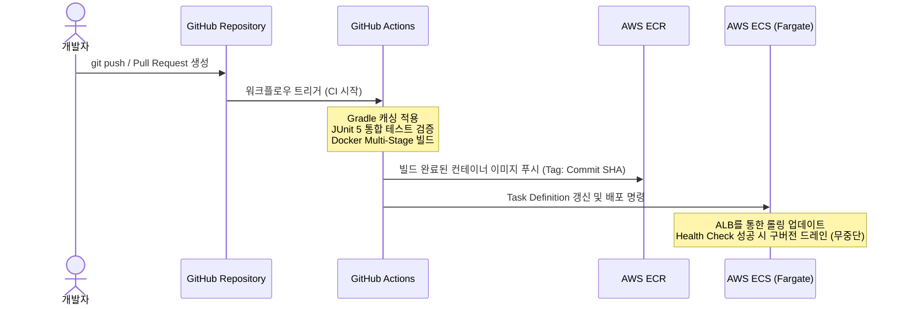

# ✈️ Onde (온데) Backend - 통합 여행 및 예약 플랫폼

> **Onde**는 항공권, 숙박, 렌터카 등 여행에 필요한 모든 서비스를 한곳에서 편리하게 예약하고 관리할 수 있는 차세대 통합 여행 플랫폼의 백엔드 시스템입니다.  
> 확장성과 독립성을 위해 **Spring Boot 멀티 모듈 아키텍처**를 채택하였으며, 대규모 트래픽 처리를 위한 분산 캐싱, 정교한 결제 및 정산 스케줄링을 지원합니다.

---

## 1. 프로젝트 소개
* **프로젝트 명**: Onde (온데)
* **개발 목적**: 항공, 숙박, 렌터카 서비스를 유기적으로 연결하여 끊김 없는 사용자 여행 경험을 제공하고, 관리자에게는 매출 관리 및 파트너 어드민 도구를 지원합니다.
* **핵심 지향점**:
  * **멀티 모듈 구조**: 공통 도메인 영역과 사용자/관리자 서비스를 완전히 분리하여 각 모듈의 독립적인 진화 가능.
  * **안정적인 예약 관리**: 동시성 제어 및 실시간 재고 관리 시스템 구축.
  * **인프라 자동화**: Docker Compose 환경 구축을 통한 빠른 개발 환경 구성 및 데이터 초기 시딩 자동화.

---

## 2. 주요 기능
### 🚗 실시간 렌터카 검색 및 예약
* **위치 기반 차량 검색**: 프론트엔드에 정의된 25개 주요 도시별 차량 목록 필터링.
* **재고 및 요금 실시간 조회**: 렌터카 재고(Inventory) 테이블과의 일자별 조인을 통한 실시간 예약 가능 여부 및 최저 가격 연동.
* **예약 흐름**: 차량 선택 -> 대여 및 반납 일자 입력 -> 결제 및 예약 상태 생성.

### 🏨 숙소 및 객실 예약
* **숙소 검색**: 카테고리, 지역별 필터링 기능 제공.
* **실시간 객실 재고 제어**: 동시 예약 발생 시 초과 예약(Overbooking)을 방지하기 위한 트랜잭션 관리.

### 🛫 실시간 항공권 검색 및 예약 (진행 중)
* **스케줄 및 노선 조회**: 판매자 승인 상태가 완료된 항공 노선 및 상세 스케줄 필터링.
* **실시간 타임아웃 스케줄러**: 결제 대기 시간 초과 시 자동으로 예약을 취소하는 스케줄러 구동.

### 👤 권한 기반 인증/인가 (Spring Security + JWT)
* **통합 회원 가입 및 로그인**: 일반 사용자 및 관리자 통합 JWT 발급.
* **어드민 허브**: 권한(`USER`, `SELLER`, `USER_ADMIN`, `SUPER_ADMIN`)에 따른 접근 통제 및 백오피스 대시보드 API.

---

## 3. 기술 스택

### Cores
* **Java 17**
* **Spring Boot 3.2.5**
* **Gradle 8.7**

### Database & Storage
* **MariaDB 11.4** (메인 RDBMS)
* **Redis 7.2** (분산 락, 캐싱, 세션 관리)
* **MinIO** (로컬 S3 Mock 오브젝트 스토리지)
* **Flyway 9.22** (데이터베이스 스키마 마이그레이션 버전 관리)

### Dev & Ops
* **Docker / Docker Compose** (컨테이너 오케스트레이션)
* **Lombok / SLF4J (Logback)**

---

## 4. 빠른 시작 (Quick Start)

### 필수 요구사항
* 로컬 환경에 **Docker Desktop**이 설치되어 있어야 합니다.

### 실행 방법
1. **프로젝트 루트 디렉토리로 이동**
   ```bash
   cd c:/Users/user/Desktop/hotfix_project
   ```

2. **도커 컨테이너 전체 빌드 및 기동**
   ```bash
   # 데이터베이스, 레디스, 미니오, 백엔드(API/Admin), 프론트엔드가 한 번에 실행됩니다.
   docker compose up --build -d
   ```

3. **로컬 데이터 시드(Seed) 확인**
   * 서버 기동 완료 후, `db-seeder` 컨테이너가 동작하여 `/DB_Seed` 내에 있는 기초 데이터(회원, 숙소, 객실, 렌터카 270대 등)를 MariaDB에 자동으로 로딩합니다.

4. **로컬 접속 정보**
   * **사용자 API (api-module)**: `http://localhost:8080`
   * **관리자 API (admin-module)**: `http://localhost:8081`
   * **데이터베이스 (MariaDB)**: `localhost:3306` (ID: `onde` / PW: `ondepass` / DB: `onde`)

---

## 5. 폴더 구조
본 프로젝트는 관심사 분리를 극대화하기 위해 멀티 모듈 프로젝트로 관리되고 있습니다.

```text
Onde_Backend/
├── core-module/          # 공통 도메인 엔티티, 리포지토리 및 공통 비즈니스 로직
│   └── src/main/resources/db/migration/  # Flyway 마이그레이션 SQL 파일 보관함
├── api-module/           # 일반 사용자용 REST API 및 인증(Security) 계층
│   └── src/main/java/com/onde/api/application/
│       ├── accommodation/ # 숙소 및 렌터카 컨트롤러/서비스
│       └── notification/  # 알림 및 푸시 기능 (Firebase Cloud Messaging)
├── admin-module/         # 백오피스 관리자용 전용 API 및 통계 비즈니스 계층
├── gradle/               # Gradle 래퍼 환경 설정 파일
├── build.gradle          # 루트 멀티 모듈 전체 빌드 스크립트
└── settings.gradle       # 하위 모듈(core, api, admin) 정의 설정 파일
```

---

## 6. 아키텍처 개요
```mermaid
graph TD
    subgraph Client
        FE[Frontend - Vite/React]
    end

    subgraph Service Layer (Multi-Module)
        API[api-module: Port 8080]
        ADMIN[admin-module: Port 8081]
        CORE[core-module: Shared Entities/Repos]
    end

    subgraph Data Layer
        DB[(MariaDB)]
        RD[(Redis Cache)]
        S3[(MinIO Storage)]
    end

    FE -->|User Requests| API
    FE -->|Admin Requests| ADMIN
    API -.->|Depends on| CORE
    ADMIN -.->|Depends on| CORE
    CORE --> DB
    CORE --> RD
    CORE --> S3
```
* **도메인 격리**: `core-module`은 데이터베이스 및 데이터 스토리지 액세스 기술과 결합하고, 외부 서비스 모듈(`api-module`, `admin-module`)은 `core-module`을 라이브러리 형태로 의존하여 API 설계에만 집중할 수 있게 분리하였습니다.

---

## 7. API 엔드포인트 예제
### 🚗 렌터카 검색 API
* **요청 (Request)**
  * `GET /api/v1/cars/search`
  * Query parameters:
    * `pickup`: 대여 일시 (예: `2026-06-10T10:00:00`)
    * `returnTime`: 반납 일시 (예: `2026-06-12T10:00:00`)
    * `location`: 대여 도시 (예: `제주`, `서울`, `도쿄` 등)
    * `carType`: 차량 유형 (예: `전기 SUV`, `스포츠카` 등)
* **응답 (Response)**
  ```json
  {
    "status": "SUCCESS",
    "message": "렌터카 조회가 완료되었습니다.",
    "data": {
      "cars": [
        {
          "carId": 1,
          "modelName": "Audi A4",
          "carType": "럭셔리 세단",
          "licensePlate": "QA-227-CK",
          "dailyPrice": 75000,
          "location": "제주",
          "available": true
        }
      ],
      "totalCount": 1
    }
  }
  ```

---

## 8. 테스트
### 테스트 구동 방법
로컬 개발 환경의 변경 사항을 비즈니스 로직별로 검증하기 위해 JUnit 5 기반의 단위/통합 테스트 환경이 준비되어 있습니다.

```bash
# 전체 빌드 및 테스트 수행
./gradlew clean build

# 특정 모듈(예: api-module)의 테스트만 따로 실행
./gradlew :api-module:test
```
* **통합 테스트**: 테스트 컨테이너 또는 테스트용 인메모리 DB(H2) 설정을 활용해 실제 데이터 연동 검증을 안전하게 수행합니다.

---

## 9. 프로덕션 인프라 전환 및 확장 로드맵 (Production Deployment & Roadmap)

본 애플리케이션은 클라우드 배포 시 소스 코드의 변경 없이 **환경 변수(Environment Variables) 설정값 주입만으로 로컬 환경에서 프로덕션 클라우드 인프라로 유연하게 배포 환경을 스위칭**할 수 있도록 설계되었습니다.

### 🌐 클라우드 인프라 전환 가이드 (AWS 기준)

| 인프라 구분 | 로컬 개발 환경 (Local Docker) | 프로덕션 운영 환경 (AWS Cloud) | 전환용 주입 환경 변수 | 아키텍처 상세 설계 |
| :--- | :--- | :--- | :--- | :--- |
| **데이터베이스** | MariaDB 컨테이너 (`mariadb:11.4`) | **AWS RDS** (Aurora MySQL / MariaDB) | `DB_URL`<br>`DB_USERNAME`<br>`DB_PASSWORD` | Multi-AZ 구성을 통해 가용성을 확보하고 Reader/Writer 엔드포인트를 분리하여 읽기 트래픽 부하 분산 고려. |
| **분산 캐시 & 락**| Redis 컨테이너 (`redis:7.2-alpine`) | **AWS ElastiCache for Redis** | `REDIS_HOST`<br>`REDIS_PORT` | 동시성 제어(분산 락) 및 빈번한 조회 데이터 캐싱을 위해 클러스터링 모드가 적용된 캐시 인프라 연동. |
| **오브젝트 스토리지**| MinIO 컨테이너 (`minio/minio`) | **AWS S3 Bucket** | `AWS_S3_ENDPOINT`<br>`AWS_S3_BUCKET` | 로컬 MinIO 모크 API에서 실제 AWS S3 Bucket으로 무중단 전환. 운영 환경 배포 시 하드코딩된 Access Key 방식 대신 **AWS IAM Role (ECS Task Role)**을 통해 자격 증명을 획득하도록 보안 설계. |
| **콘텐츠 전송 (CDN)**| Local Host Endpoint | **AWS CloudFront** | `AWS_CLOUDFRONT_DOMAIN` | S3에 저장되는 미디어 및 정적 파일의 글로벌 전송 속도 향상 및 오리진 서버 부하 감소를 위해 Edge Location 캐싱 적용. |

#### ⚙️ Spring Boot 환경 변수 바인딩 스펙 예시 (`application.yml`)
```yaml
spring:
  datasource:
    url: ${DB_URL:jdbc:mariadb://localhost:3306/onde}
    username: ${DB_USERNAME:onde}
    password: ${DB_PASSWORD:ondepass}
  data:
    redis:
      host: ${REDIS_HOST:localhost}
      port: ${REDIS_PORT:6379}
```

---

### 🚀 CI/CD 및 무중단 배포 파이프라인
GitHub Actions와 AWS 컨테이너 생태계를 연동하여 자동화된 무중단 배포 환경을 구현하는 아키텍처 로드맵입니다.



1. **지속적 통합 (CI)**:
   * GitHub Actions 워크플로우 상에서 **Gradle Build Cache**를 활성화하여 의존성 다운로드 시간 최소화.
   * `spotless`를 통한 코드 포맷 검사 및 `JUnit 5` 통합/단위 테스트 자동 통과 조건 부여.
2. **컨테이너화 및 보안 스캔**:
   * Dockerfile 내에 **Multi-Stage Build** 기술을 적용하여 JDK 빌드 레이어와 JRE 실행 레이어를 격리, 운영 컨테이너 이미지 크기를 최소화(약 200MB대).
   * AWS ECR 이미지 푸시 시 취약점 스캔(Image Vulnerability Scanning) 자동 수행.
3. **무중단 배포 (CD)**:
   * AWS ALB(Application Load Balancer)와 ECS Fargate를 연동하여 **롤링 업데이트(Rolling Update)** 방식의 배포 관리.
   * 신규 컨테이너의 Actuator 헬스체크 엔드포인트(`/actuator/health`) 호출이 성공(Healthy)하는 시점에 구버전 컨테이너를 안전하게 드레인(Drain)하여 0초 다운타임 구현.

---

### 📊 모니터링 & 옵저버빌리티 (Observability) 계획

안정적인 실시간 장애 전파 및 애플리케이션 상태 분석을 위해 아래 모니터링 스택의 순차 결합을 계획하고 있습니다.

1. **Spring Boot Actuator & Micrometer**:
   * 핵심 모니터링 지표 수집용 프로메테우스 포맷 바인딩 활성화 (`/actuator/prometheus`).
   * 시스템 메트릭(CPU, JVM 메모리 사용량, 가비지 컬렉션 타임) 및 HikariCP의 커넥션 풀 활성/대기 세션 수 실시간 모니터링 가능 구조 확보.
2. **Prometheus & Grafana 인프라**:
   * 프로메테우스 서버가 주기적으로 각 백엔드 인스턴스의 Actuator 지표를 스크래핑(Scraping).
   * 그라파나 대시보드를 구축하여 API 요청 지연 시간(Latency), 처리량(Throughput, TPS), 에러율(5xx 에러 카운트) 모니터링 시각화.
   * 지표가 특정 임계치(예: JVM 힙 메모리 85% 이상 사용, API 응답시간 2초 이상) 도달 시 **Slack Webhook 및 PagerDuty**를 통한 즉시 Alerting 알림 연동.
3. **Sentry 실시간 에러 트래킹**:
   * 실시간 예외 발생 시 스택 트레이스 및 요청 콘텍스트 정보를 자동으로 Sentry로 전송하여 사용자 불편 상황 실시간 트래킹 및 핫픽스 피드백 루프 단축.
